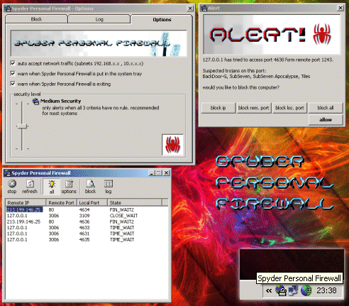



## Spyder Personal Firewall

### Description

Spyder Personal Firewall is the first firewall (with source) on PSC. currently it only supports TCP, but UDP support is just arround the corner. It has the ability to block unique remote hosts, remote ports and local ports giving you complete control over your system. Also network traffic can be ignored, and let straight through. All ips and ports that do not yet have a rule set are logged and an alert window will pop-up. Please vote and leave comments =o) UPDATE: added options, security levels, warns on exit and when moved to system tray, system tray menu, trojan list (tells if a trojan may be using connection, used for low security level).
 
### More Info
 

             |
---                |---
**Submitted On**   |2002-09-06 11:08:32
**By**             |[Nick Ridley](https://github.com/Planet-Source-Code/PSCIndex/blob/master/ByAuthor/nick-ridley.md)
**Level**          |Intermediate
**User Rating**    |4.4 (83 globes from 19 users)
**Compatibility**  |VB 6\.0
**Category**       |[Internet/ HTML](https://github.com/Planet-Source-Code/PSCIndex/blob/master/ByCategory/internet-html__1-34.md)
**World**          |[Visual Basic](https://github.com/Planet-Source-Code/PSCIndex/blob/master/ByWorld/visual-basic.md)
**Archive File**   |[Spyder\_Per127813962002\.zip](https://github.com/Planet-Source-Code/nick-ridley-spyder-personal-firewall__1-38673/archive/master.zip)

